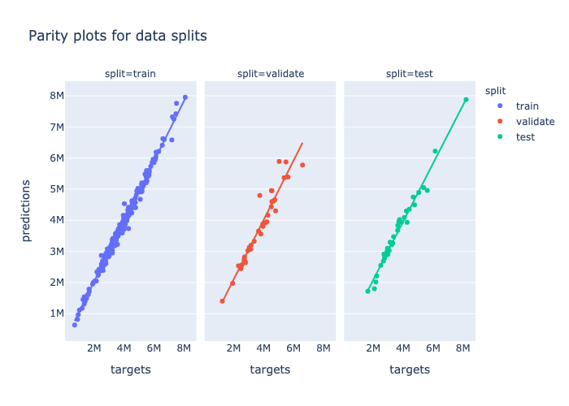
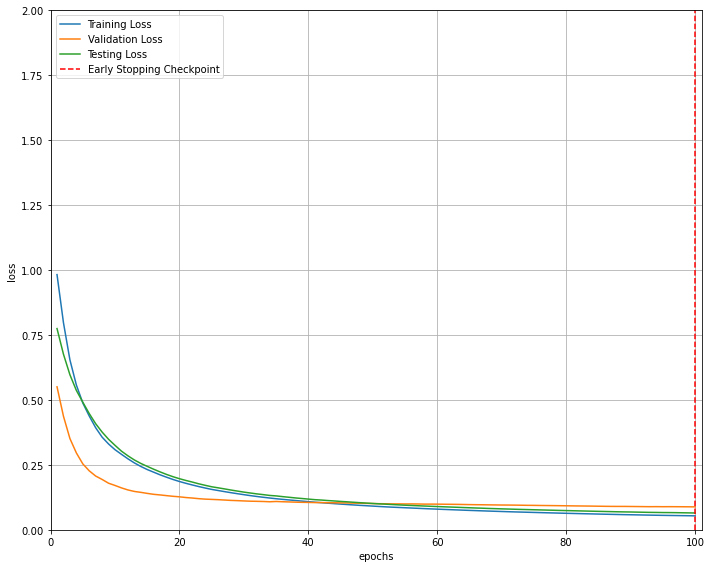

<!-- ADD LINKS? linkedin, email, -->

## Education
- **Master’s of Science**, Human Centered Artificial Intelligence | Denmarks Technical University (_Graduated June 2023_)
    - **Relevant Coursework**: Project Management, User Experience Engineering, Computational tools for data science, Introduction to machine learning and data mining, Social Graphs and Interactions, Social Data Analysis and Visualization. Personal data interaction.
- **Bachelor’s of Science**, Network Technology and IT | Denmarks Technical University (_Graduated June 2018_)
    - **Relevant Coursework**: Data Structures, Software Engineering, Introduction to programming and data processing. Introduction to mathematical statistics. 

## Projects

### Master Thesis : Applications of Graph Neural Networks in Chemical Property Prediction

Applied the Graph Neural Networks (GNN) to generate a molecular representation by mapping and extracting hidden features (states) present in the data and relating these to the target property. Trained the GNN models for featurization and prediction of the chemical property. Achieved very high precision of model performances for the prediction. The best model performance has R2 results of 0.9980. Language: **Python**

<table>
  <tr>
     <td>Parity plot</td>
     <td>Training Loss</td>
  </tr>
  <tr>
    <td></td>
    <td></td>
  </tr>
 </table>

### What can we learn from 20 years of headlines?
[Project]( https://miniphant.github.io/socialgraphs/)

Data analysis of exploring news headlines data from the guardian news page. Data uagmentation, data proscessing, data visualizations, NLP language processing, text analysis, network analysis and sentimetal analysis. Programming language : **Python**

<table>
  <tr>
     <td>Words Cloud for News headlines in 2013 </td>
     <td>Words Cloud for News headlines in 2018i</td>
  </tr>
  <tr>
    <td></td>
    <td></td>
  </tr>
 </table>

### Donald Trump and Twitter!
[Project](https://observablehq.com/d/dde4f0b3d856ee24/)

The project is about data analysis and data visualization of Donald Trump's Twitter activity during the first 100 days after his election. Data analysis includes text analysis & wordclouds, sentimental analysis & polarity of Trumps tweets. Language :  **python** & **Typescript**.

<table>
  <tr>
    <td>sentiment Analysis</td>
     <td>Words Cloud for Trumps tweets</td>
  </tr>
  <tr>
    <td></td>
    <td></td>
  </tr>
 </table>

## Work Experience
### Solvita A/S 
***Educational Consultant*** (_December 2024 – Present_)
- Provide administrative works. Provide guidance. Develop plans. 

### Tolkdanmark ApS
***Freelance Interpreter/Translator*** (_Jan 2022 – Present_)
- In-person Interpreting. Legal Document Translation. Clinical & Court Experience. Municipality experience.
- Language: Danish & Burmese.
  

## Skills and Hobbies

**Skills**: Programming, Java, Python, SQL, Project management, UI/UX Design, Copywriting & Content Writing.

**Hobbies and Interests**: Reading, Walking, Graphic Design, Burmese/Chin Culture and Issues

